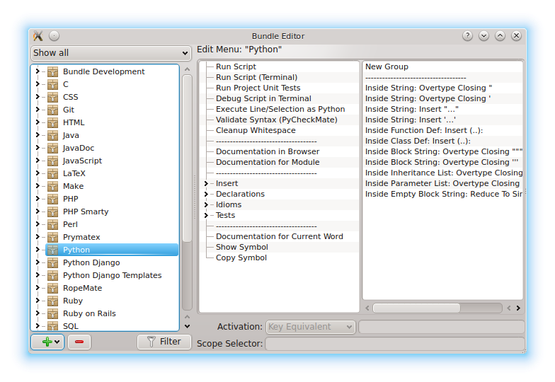
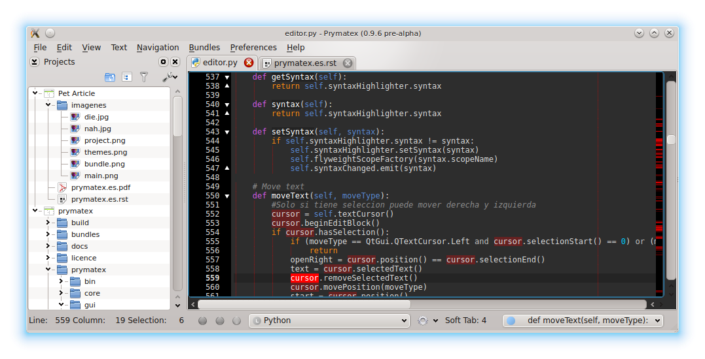

Prymatex
========

.. class:: endnote

+-------------------------------+-----------------------------------------------------------------+
| .. image:: imagenes/nahdie.jpg|                                                                 |
|    :class: center foto        | :Autores: Nahuel Defossé, Diego van Haaster                     |
|                               |                                                                 |
|                               | :Bio:                                                           |
|                               |     Mini biografia                                              |
|                               |                                                                 |
|                               | :Web: http://prymatex.org/blog                                  |
|                               |                                                                 |
|                               | :Emails:  diegomvh@gmail.com nahuel.defosse@gmail.com           |
|                               |                                                                 |
|                               | :Twitter: @diegomvh @D3f0                                       |
+-------------------------------+-----------------------------------------------------------------+

Prymatex es un editor de texto multiplataforma basado en el popular TextMate de Mac.
Al igual que éste, se compone de un editor minimalista extensible,
y cuenta con una gran cantidad de extensiones que le brindan funcionalidad específica
para muchos lenguajes y herramientas.

Cada extensión se denomina Bundle y puede contener varios recursos como:

  - sintaxis
  
  - comandos (compilar, usar herramientas externas, entre otras)
  
  - snippets (trozos de códigos auto-insertables)
    
  - macros (acciones pre grabadas)

  - plantillas de archivos y proyectos
  
  - preferencias de configuración

Cada componente de un bundle está contenido en un formato de serialización XML
de Apple, llamado *plist* y que desde Python 2.6 se puede leer como un diccionario.
 
En el siguiente fragmento corresponde al plist del comando
**Documentation in Browser** del bundle **Python**.

.. code-block:: XML

    <?xml version="1.0" encoding="UTF-8"?>
    <!DOCTYPE plist PUBLIC "-//Apple Computer//DTD PLIST 1.0//EN" "http://www.apple.com/DTDs/PropertyList-1.0.dtd">
    <plist version="1.0">
    <dict>
    	<key>beforeRunningCommand</key>
    	<string>nop</string>
    	<key>command</key>
    	<string>TPY=${TM_PYTHON:-python}
    
    echo '&lt;html&gt;&lt;body&gt;'
    "$TPY" "${TM_BUNDLE_SUPPORT}/browse_pydocs.py"
    echo '&lt;/body&gt;&lt;/html&gt;'</string>
    	<key>input</key>
    	<string>none</string>
    	<key>keyEquivalent</key>
    	<string>^H</string>
    	<key>name</key>
    	<string>Documentation in Browser</string>
    	<key>output</key>
    	<string>showAsHTML</string>
    	<key>scope</key>
    	<string>source.python</string>
    	<key>uuid</key>
    	<string>095E8342-FAED-4B95-A229-E245B0B601A7</string>
    </dict>
    </plist>

El script que ejecutara Prymatex se encuentra en la clave **command** y
como se puede observar, consiste en un script escrito en Bash.
El contexto de ejecución del script esta definido por el resto de las claves,
al pulsar las teclas **keyEquivalent** se toma la entrada **input**
para posteriormente ejecutar el script y dirigir la salida a **output**.

Si bien este comando está escrito en Bash, los scripts se pueden 
escribir en cualquier lenguaje que soporte leer y escribir la entrada estandard,
interactuar con las variables de ambiente y retornar un código de salida entero.
Debido a estos requirimientos mínimos, encontramos Bundles con comandos en
escritos en Ruby, Bash, Perl, PHP, Python, awk, entre otros. Todo está limitado
a lo que el usuario quiera poner en el shebang.

Esta forma sencilla de extender el editor a dotado a TextMate de 
una gran popularidad. Una búsqueda en github con el texto *tmBundle*
nos arroja más de 4000 repositorios como resultado. Muchos son forks
de los bundles más populares, pero podemos decir sin dudas que TextMate es el 
editor que más lenguajes soporta.

Anatomía de un Bundle
*********************

Analicemos con algo de detalle los componentes destacados de un Bundle para
comprender la capacidad de Prymatex como editor de textos para programadores
o usuarios con necesidades de un editor extensible.

Los elementos que componen a un Bundle extienden la funcionalidad del editor
significativamente, las sintaxis incorporan la metadata al texto tipeado y 
los comandos, snippets y macros definen las posibles acciones a ejecutar cuando
se reunen las condiciones adecuadas. Estas condiciones estan dadas por un 
*ámbito*, *un atajo de teclado*, *la tecla de tabulación* o la combinacion de
varias.

Todos los elementos que componen a un Bundle terminan siendo encapsulados en
archivos *plist*, estos pueden almacenarse en distintas ubicaciones dando lugar
a los espacios de nombres.

Sintaxis
--------

Los archivos de sintaxis definen principalmente la gramática del lenguaje.

Las gramáticas que se expresan en los archivos de sintaxis asocian a cada
palabra o símbolo analizado, con un ámbito o *scope*. A medida que el usuario
escribe en el editor, el resaltador de sintaxis asigna a cada caracter un *scope*.
El *scope* es la *piedra angular* del editor y en base a él se definen muchas de
las posteriores acciones (comandos, snippets, macros), como así también el
típico coloreado de cualquier editor de texto para programadores.

.. image:: imagenes/themes.png
  :scale: 40%

Una gramática se define mediante expresiones regulares en Oniguruma las cuales
no son 100% compatibles con las del módulo nativo de python, **re**. [*]_
Esta "no compatibilidad" se superó con *Ponyguruma*, un binding para oniguruma
desarrollado por Pocoo (autores de Flask, Jinja2, Pygments o Sphinx).

.. [*] Prymatex intenta utilizar *re* por razones de velocidad, pero
        si falla la compilación, recurre a Ponyguruma.

Comandos
--------

Los comandos son acciones que pueden tomar datos del editor (documento, linea,
caracter, etc) y luego de ejecutar un script redirigir la salida nuevamente
hacia el editor (insertar, remplazar, mostrar en el browser, etc). 

Un comando que se repite en casi todos los bundles, es Run y se ejecuta con la
tecla Windows o Meta + R. La salida del comando generalmente se muestra en el
browser integrado. Es destacable que no se necesita guardar incluso en 
lenguajes compilados como C o C++.

Snippets
--------

Los snippets son pequeñas fracciones de texto que se utilizan para alivianar la
inserción de código repetitivo. 

Están definidos como texto, expresiones regulares y *"huecos"* o *holders*, 
estos últimos representan los lugares variables a completar por el usuario
y son novegables mediante la tecla de tabulación. Por ejemplo, bajo la sintaxis
de Python, tras tipear *try* y presionar la tecla de tabulación, se inserta la
definición de un bloque try/except y con cada tabulación el usuario puede
modificar los holders definidos.

.. code-block:: python

    try:
    	${1:pass}
    except ${2:Exception}, ${3:e}:
    	${4:raise $3}
    finally:
    	${5:pass}

Proyectos
*********

.. Administración de varios proyectos, cada proyecto
.. Mencionar los templates de proyectos y los bundles en los proyectos 

Prymatex provee un administrador de proyectos como un panel lateral que
visualiza el contenido del sistema de archivos. Dentro de la carpeta del proyecto
se genera un directorio oculto donde se almacena la meta información sobre 
el proyecto.

Los proyectos no solo sirven como organización lógica del espacio de trabajo
sino que también definen en sí mismos un espacio de nombres; esto provee la
posibilidad de generar Bundles dentro del proyecto y por lo tanto habilita a la
redistribución para homogeneizar las tareas del grupo. En el menú contextual de
un proyecto se pueden generar asociaciones con Bundles permitiendo esto
ejecutar acciones sobre los archivos que contiene.

Pretendiendo extender las características de los Bundles de TextMate, Prymatex
define plantillas de proyectos, de una forma similar a las plantillas de
archivos, estas ayudan en la generación de código boilerplate que existe al
iniciar un nuevo proyecto.

Edición
*******

Prymatex incorpora varias herramientas para agilizar el tipeo de código, buena 
parte de ellas están dadas por los macros o regidas por las preferencias de 
cada Bundle, y como tal se aplican según su *scope*.

El autocompletado básico del editor esta basado en las palabras tipeadas y
analizadas aunque igualmente provee una API para hacer llegar al sistema de
autocompletado sugerencias que ingresen de la ejecución de comandos.

Un aspecto que llama generalmente la atención es el modo multicursor, Prymatex
activa este modo al seleccionar con el puntero zonas de código o mediante la
pulsación de teclas especificas, posteriormente con el modo activo podemos 
escribir en varios lugares del documento al mismo tiempo.

Instalación
***********

Dependencias
------------

.. code-block:: bash

    $ sudo apt-get install python python-dev python-qt4 cmake git
    $ sudo apt-get install x11-xserver-utils ipython python-zmq libonig-dev
    
Ponyguruma
----------

.. code-block:: bash

    $ git clone https://github.com/prymatex/ponyguruma.git
    $ cd ponyguruma
    $ python setup.py build
    $ sudo python setup.py install
    
QTermWidget
-----------

.. code-block:: bash

    $ git clone https://github.com/prymatex/qtermwidget.git
    $ cd qtermwidget
    $ cmake .
    $ make
    $ sudo make install
    $ cd pyqt4
    $ python config.py
    $ make 
    $ sudo make install

Prymatex (sources)
------------------

.. code-block:: bash

    $ git clone https://github.com/prymatex/prymatex.git
    $ cd prymatex/prymatex/bin/
    $ python pmx.py
