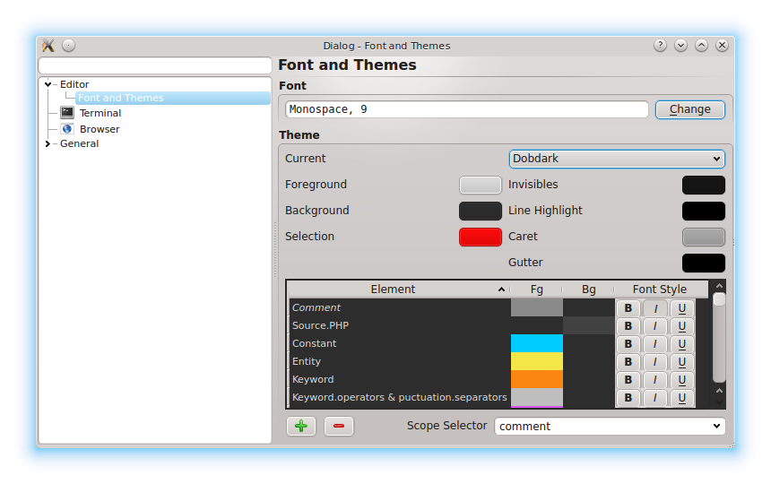

Prymatex
=================

.. class:: endnote

+-------------------------------+-----------------------------------------------------------------+
| .. image:: imagenes/nah.jpg    |                                                                 |
| .. image:: imagenes/die.jpg   | :Autors: Nahuel Defossé, Diego van Haaster                      |
|    :class: right foto         |                                                                 |
|                               | :Bio:                                                           |
|                               |     Mini biografia                                              |
|                               |                                                                 |
|                               | :Web: http://prymatex.org/blog                                  |
|                               |                                                                 |
|                               | :Emails: nahuel.defosse@gmail.com diegomvh@gmail.com            |
|                               |                                                                 |
|                               | :Twitter: @D3f0 @diegomvh                                       |
+-------------------------------+-----------------------------------------------------------------+

Prymatex es un proyecto de creación de un editor de texto
multiplataforma basado en el popular TextMate de Mac.
Al igual que éste, se compone de un editor minimalista extensible,
y cuenta con una gran cantidad de extensiones que le brindan funcionalidad específica
para muchos lenguajes y herramientas.

Cada extensión se denomina Bundle y puede contener 
varios recursos como:

  - sintaxis
  
  - snippets (trozos de códigos auto-insertables)
  
  - comandos (compilar, usar herramientas externas, entre
    otras)
    
  - macros (acciones pre grabadas)
    
  - plantillas de archivos
  
  - preferencias de configuración
  
  - herramientas auxiliares (ej **support/bin**,
    **support/lib**)

Cada compnente del bundle está contenido en un formato
de serialización XML de Apple, llamado *plist* y que 
desde Python 2.6 se puede leer como un diccionario. Por ejemplo, 
en el siguiente fragmento de código corresponde 
al comando **Compile Single File to Tool**. 
El contendio de un comando se encuentra en la clave **command** y
como se puede observar, consiste en un script escrito en Ruby que 
Prymatex ejecutará cuando el usuario active el comando. 
Podemos observar otros detalles, como la clave **output**,
que indica al editor que la salida del script será visualizada
como tooltip.

.. code-block:: XML

    <dict>
    <key>beforeRunningCommand</key>
    <string>nop</string>
    <key>command</key>
    <string>#!/usr/bin/env ruby
    #
    # Compile the active file to an executable.
    # Executable name is prefixed with "Test".

    require 'English'

    FilePath		= ENV['TM_FILEPATH']
    FileDir		= ENV['TM_DIRECTORY']
    FileBaseName	= File.basename(FilePath)
    FileExtension	= File.extname(FilePath)
    FileNoExtension = FileBaseName.sub(/#{FileExtension}$/, "")

    Dir.chdir(ENV['TM_DIRECTORY'])

    # have to use g++ to bring in C++ runtime libraries
    cc = case FileExtension
    when /\.c(pp?|xx|\+\+)/,'.C','.ii'
         'g++'
    else
         'gcc'
    end

    puts %x{ "#{cc}" -g -Wmost -Os -o "Test#{FileNoExtension}" "$TM_FILEPATH"}

    puts "Successfully created Test#{FileNoExtension}" unless $CHILD_STATUS != 0
    </string>
    <key>input</key>
    <string>none</string>
    <key>keyEquivalent</key>
    <string></string>
    <key>name</key>
    <string>Compile Single File to Tool</string>
    <key>output</key>
    <string>showAsTooltip</string>
    
Si bien este comado está escrito en Ruby como casi la gran mayoría,
estos se pueden escribir en cualquier lenguaje que soporte leer y 
escribir la entrada estandard, interactuar con las variables de ambiente
y retornar un código de salida entero. Debido a estos requirimientos mínimos,
encontramos Bundles con comandos en escritos en shell, Perl, PHP, Python, 
awk, entre otros. Todo está limitado a lo que el usuario quiera 
poner en el shebang.

Esta forma sencilla de extender el editor a dotado a TextMate de 
una gran popularidad. Una búsqueda en github con el texto *tmBundle*
nos arroja más de 4000 repositorios como resultado. Muchos son forks
de los bundles más populares, pero podemos decir sin dudas que TextMate es el 
editor que más lenguajes soporta.

Anatomía de un Bundle
---------------------

Analicemos con algo de detalle los componentes de una
Bundle para comprender la capacidad de Prymatex como
editor de textos para programadores o usuarios con 
necesidades de un editor extensible.

Sintaxis
========
Los archivos de sintaxis definen la gramática del lenguaje y
las extensiones de archivo que soporta y 
una expresion regular llamada **firstLineMatch** que sirve
para identificar archivos sin extensión a partir de su primera
linea de texto.

Las gramáticas que se expresan en los archivos de sintaxis
asocian a cada palabra o símbolo del archvivo, con un *ambito*
(o scope). A medida que el usuario escribe en el editor, 
el resaltador de sintaxis asigna a cada letra un *ambito*.
Además de la sintaxis, existe en forma global una tema que 
relaciona *ambitos* con estilos de fuentes con el cual se 
completa el coloreado típico de cualquier editor de texto
para programadores.

Las gramáticas están expresadas con expresiones regulares 
para el motor Oniguruma que no son 100% compatibles con las
del módulo nativo de python, **re**. [*]_ Afortunadamente encontramos
en Pocoo (autores de módulos muy famosos como Flask, Jinja2, Pygments
o Sphinx) un binding llamado *Ponyguruma* que nos permitió
compatiblizar a Prymatex con TextMate.

Cada archivo abierto está resaltado por alguna sintaxis, aún
cuando el archvivo no esté guardado. Esto permite siempre determinar
el *ambito* de la posición del cursor. 

.. [*] Prymatex intenta utilizar *re* por razones de velocidad, pero
        si falla la compilación, recurre a Ponyguruma.

Snippets
========

Los snippets son pequeñas fracciones de texto que están
disponibles bajo algún atajo de teclado o activación con
la tecla tabulación. Suelen alivianar la inserción de código
repetitivo.

En Prymatex están definidos como expresiones
regulares con varios *"huecos"* o *holders*. Estos se van
alternando cuando el usuario presiona la tecla tabulación.
Por ejemplo, bajo la sintaxis de Python, tras tipear *def* o
*class* y presionar la tecla de tabluación, se inserta la
definición de una función, o clase. Con cada tabulación
el usuario puede agregar el nombre, el *docstring*, los
atributos, etc. Al llenar cada hueco, pueden haber huecos
*dependientes*, por ejemplo, al ir definiendo el nombre
de la clase, el docstring se adapta al nombre de la clase.

No todos los snippets están disponibles todo el tiempo, 
muchos están limitados a cierto *ambito* donde tienen 
importancia. Por ejemplo, la definición de métodos
solo tiene relevancia dentro de una clase.

Comandos
========

Los comandos son scripts que se ejecutan en bash o
cualquier otro intéprete definido en el shebang.

Al igual que los snippets, algunos comandos
están restringidos a cierto ámbito.

Los comandos pueden tomar la entrada del documento,
linea, caracter o ámbito y su salida puede ser
remplazar el documento acutal o la selección, 
insertar la salida como snippet, mostrarse como
tooltip, como HTML en el browser o crear un nuevo
documento.

A menudo los comandos neceistan parametros de usuario, 
para esto existe una utilidad de comandos llamada
tmDialog (por TextMate dialog) el cual fue preciso
implementar para poder dar soporte a los comandos
preexistentes. El diálogo es similar a Kdialog o zenity.

Un comando que se repite en casi todos los bundles, 
es Run y se ejecuta con la tecla Windows o Meta + R.
La salida del comando se muestra en el browser. Es
destacable que no se necesita guardar incluso en 
leguajes compilaods como C o C++ (algo que no sorprende
tanto en lenguajes interpretados).

Preferencias y Macros
=====================

Algunas preferencias que soporta TextMate

Más allá de las características de TextMate
===========================================

Dependencias
------------

    - PyQt4 4.8
    - python-pyzmq
    - ponyguruma
    